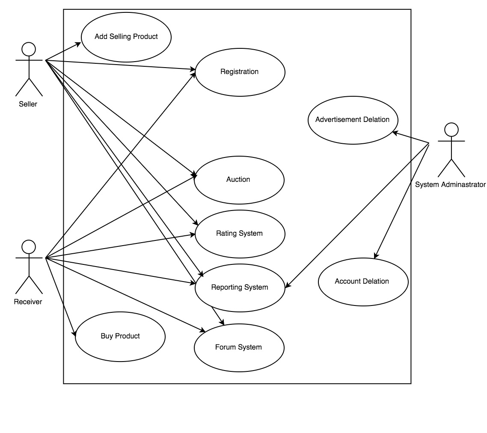

## Purpose of the project
In recent years in our country, farming products prices is increased highly by the time that consumers buy them. The goal of this platform is to decrease workload, time and economic burden and increase satisfaction of last consumer.

Dev Blog Weekly
============
Date | Weekly Work
----- | -----
Week 1 (15.10 - 22.10) | Studying Django Tutorial 
Week 2 (22.10 - 29.10) | Studying Django Tutorial and Making Database Structure
Week 3 (29.10 - 05.11) | Registration Form for User
Week 4 (05.11 - 12.11) | Add selling and Buy Product for User
Week 5 (12.11 - 19.11) | Advertisement and Account Deletion
Week 6 (19.11 - 26.11) | Rating System
Week 7 (26.11 - 03.12) | Reporting System
Week 8 (03.12 - 10.12) | Auction
Week 9 (10.12 - 17.12) | Auction
Week 10 (17.12 - 24.12) | Form System
Week 11 (24.12 - 31.12) | Create Template

Use Case Diagram
===========

### Use Case of Registration

 1. User open the web page
 2. Click the **registration** button
 3. Fill the registration form correctly
 4. Submit the form
	1. Validation of user informations
	2. If validation successful go to step 4, else go to step step 3
5. The user check the mail box
	1. The mail is not sent user click the **resend mail** button and go to step 5
6. Click the **confirm** button in the mail
7. Registration completed.

### Use Case Of Selling Product

1. User login the account
2. User click the **sell product** button which on the profile page
3. Fill the product information's form
4. Submit the form
	1. Validation of product informations
	2. If validation successful go to step 5, else go to step step 4
5. The sale advertisement seem on the profile 
6. If the user want edit the product profile click the **edit** button, and go to step 3

### Use Case Of Buy Product

1. User login the account
2. User can search product with filter
    1. User sort the products (price, kind, date etc.)
    2. User comparate any product each other and choose whatever user wants    
3. User communicate the seller
4. If user and seller executive trade agreement, user click **contract** button and send feedback the system
    1. If user and seller do not deal each other, user go to step 2 
5. System delete the product info

### Use Case Of Auction System

1. The auctions should create 1 week ago before the auction date
2. Throughout the auction time who gives the most money is buy the product

**Auction For Seller**

1. Seller login the account
2. Seller create an auction event
    1. Fill the product info
    2. Fill opening price
    3. Fill increasing price
    4. Fill auction start date
    5. Fill amount of time of auction
3. The auction is added the system

**Auction For Buyer**

1. User login the account
2. User go to auction page
3. User choose the auction
4. User join the auction he chose
5. The system send a notification to User, before auction start an hour ago
6. User start the auction

### Use Case Of Rating System

1. User and buyer aggree with each others
2. Product come to buyer
3. Buyer comfirm the product that come
4. Rating
    1. Buyer rate for seller's product(product's quality, seller's reliability, seller's communication)
    2. Seller rate for buyer's reliability and communication
5. Other users see the rating in user's profile page 
6. Rating done

### Use Case Of Reporting System

1. User open the user's profile who complaines
2. User click the report button 
3. Open the report page 
4. Choose the report reason and fill the text and upload the file for evidence
5. Report go the sytem 
6. System admin evaluate the report
